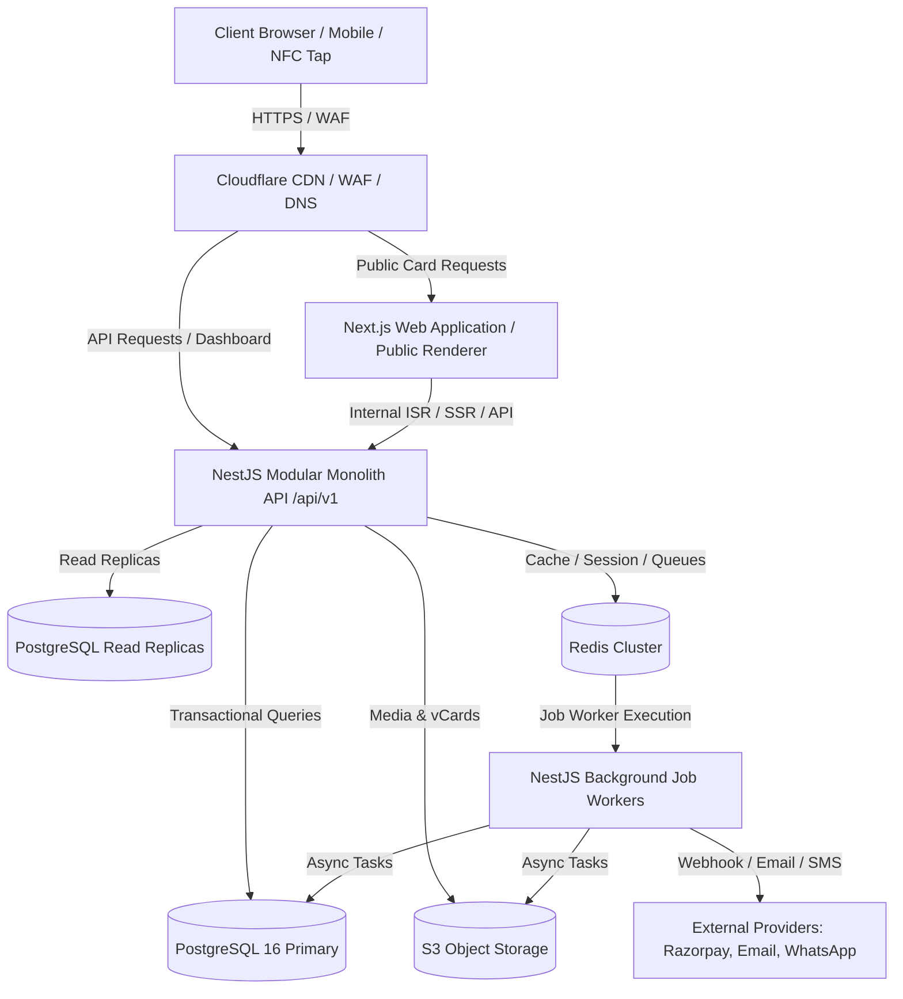

# 01 — System Architecture

**Document Version:** 1.0  
**Status:** Approved Technical Architecture  
**Scope:** System Boundaries, Component Topology, Data & Execution Flows  

---

## 1. System Overview

Alpha is a multi-tenant, India-first, globally extensible Digital Professional Identity and Visiting Card SaaS platform. The system is designed as a **TypeScript monorepo with a modular-monolith backend API** and a **Next.js web application frontend**, backed by PostgreSQL, Redis, S3-compatible object storage, and Cloudflare CDN/WAF infrastructure.



---

## 2. Component Boundaries & Monorepo Structure

The project is structured as a single unified monorepo using standard package management workspaces:

```text
/
├── apps/
│   ├── web/                # Next.js 14+ Web Application (Dashboard, Card Builder, Public Card Renderer, Marketing)
│   ├── api/                # NestJS Backend Modular Monolith API (/api/v1)
│   └── admin/              # Platform Super-Admin Dashboard Application
│
├── packages/
│   ├── ui/                 # Shared React UI Component Library & Design System
│   ├── database/           # Prisma/Drizzle/Kysely ORM Schemas, Migrations & Data Access Layer
│   ├── config/             # Shared TypeScript configuration, Environment Validation & Constants
│   ├── auth/               # Passport/JWT Authentication Helpers, Guards & Session Utilities
│   ├── entitlements/       # Configuration-driven Entitlement Engine & Feature Evaluators
│   ├── billing/            # Provider-agnostic Billing & Razorpay Integration Layer
│   ├── analytics/          # Async Analytics Event Collectors & Aggregate Processors
│   ├── notifications/      # Multi-channel Notification Adapters (Email, SMS, WhatsApp)
│   └── types/              # Shared DTOs, Domain Interfaces, API Contracts & OpenAPI Schemas
│
├── docs/
│   └── architecture/       # System Architecture & Implementation Specifications (01 - 37)
│
├── infrastructure/
│   ├── docker/             # Dockerfiles & Local Development docker-compose setup
│   └── terraform/          # AWS Cloud Infrastructure as Code (VPC, ECS, RDS, Redis, S3)
│
└── tooling/                # ESLint, Prettier, Jest, and CI scripts
```

### Module Boundary Rules
1. **Applications (`apps/*`)** consume **Packages (`packages/*`)**.
2. **Packages (`packages/*`)** are strictly decoupled from applications and must not import from `apps/*`.
3. Domain logic resides in `packages/*` or backend modular domain services inside `apps/api/src/modules/`.
4. Domain modules interact via explicit service interfaces or internal async event buses, avoiding tight circular dependencies.

---

## 3. High-Level Request Execution Flows

### 3.1 Public Card Access Flow
1. User or NFC tap scans QR/vanity link (e.g., `https://alpha.com/c/7Kx9mP4QaZ8Vt2N6` or `https://alpha.com/shashank`).
2. Cloudflare CDN checks edge cache for published card static HTML/JSON projection.
3. If Cache Miss: Request routes to `apps/web` (Next.js SSR/ISR).
4. `apps/web` calls `apps/api` `/api/v1/public/cards/:identifier`.
5. API resolves public ID / vanity alias, applies domain visibility rules, and returns sanitized projection DTO.
6. Async Analytics Event is emitted to Redis queue without blocking public rendering.
7. Next.js renders and caches public card view.

### 3.2 Authenticated Dashboard API Request Flow
1. Frontend makes request with Bearer JWT / Session Cookie to `apps/api` `/api/v1/workspaces/:workspaceId/cards`.
2. **Auth Guard:** Validates session / JWT token signature and extracts `userId`.
3. **Tenant Interceptor:** Extracts target `workspaceId` from header/route parameter and verifies active user membership.
4. **RBAC Guard:** Validates if membership role contains required permission (`cards.create`).
5. **Entitlement Guard:** Evaluates active workspace plan entitlements and current usage count.
6. **Domain Service:** Executes transactional logic in PostgreSQL repository.
7. **Audit Interceptor:** Logs mutations to audit store if action is privileged.

---

## 4. Failure Recovery & Resiliency

1. **Database Failover:** Primary PostgreSQL database uses multi-AZ replication with automatic failover.
2. **Redis Outage:** If Redis is temporarily unreachable, cache layer degrades gracefully to direct DB reads; queueing falls back to retry buffer.
3. **Async Queue Retries:** Failed background jobs (emails, webhooks) retry with exponential backoff up to 5 attempts before moving to Dead Letter Queue (DLQ).
4. **Webhooks:** Webhook handlers return `200 OK` after logging event payload to DB, then process asynchronously to avoid provider timeouts.

---

## 5. Architectural Compliance Checklist
- [x] Shared-DB, Shared-Schema multi-tenant design.
- [x] Decoupled public card rendering from heavy dashboard logic.
- [x] Clear monorepo package encapsulation.
- [x] Strict dependency direction from UI -> API -> Domain -> Database.
