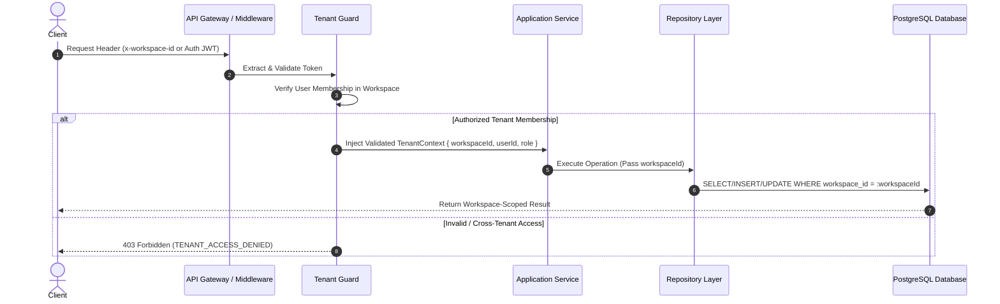

# 03 — SaaS Multi-Tenancy Architecture

**Document Version:** 1.0  
**Status:** Approved Technical Architecture  
**Scope:** Shared Database Multi-Tenancy, Tenant Isolation, Context Propagation, and Data Security Boundaries  

---

## 1. Multi-Tenancy Strategy

Alpha employs a **Shared Database, Shared Schema** multi-tenant architecture. Every tenant environment is designated as a **Workspace**. All database tables containing customer data explicitly include a non-nullable `workspace_id` foreign key column indexed for query performance and enforced via database constraints.

---

## 2. Tenant Context Propagation Architecture



---

## 3. Enforcement Layers

Tenant isolation is enforced across 7 redundant defense layers:

### Layer 1: Request Context Injection
Every request passing through `apps/api` executes `TenantContextMiddleware`. The middleware extracts the requested `workspaceId` from:
1. HTTP Header: `X-Workspace-Id`
2. URL Route Parameter: `/api/v1/workspaces/:workspaceId/...`
3. JWT Session Claims (Default workspace)

### Layer 2: Membership Authorization (NestJS Guard)
`TenantAuthorizationGuard` verifies in Redis/DB that the authenticated `userId` possesses an `ACTIVE` membership in the specified `workspaceId`.

### Layer 3: Application Service Boundary
Application services mandate `workspaceId` as the first argument for all data mutation and query methods:
```typescript
interface CardsService {
  getCardById(ctx: TenantContext, cardId: string): Promise<CardDto>;
  createCard(ctx: TenantContext, dto: CreateCardDto): Promise<CardDto>;
}
```

### Layer 4: Repository Query Scoping
Repositories automatically append `WHERE workspace_id = ctx.workspaceId` to all database read, update, and delete queries. Raw SQL or unrestricted queries without `workspace_id` are strictly forbidden.

### Layer 5: Database Constraints & Composite Keys
Uniqueness constraints MUST incorporate `workspace_id` where appropriate (e.g., custom tags per workspace):
```sql
ALTER TABLE tags ADD CONSTRAINT unique_workspace_tag UNIQUE (workspace_id, name);
```

### Layer 6: Redis Cache & S3 Storage Isolation
- **Redis Cache Key Namespacing:** `tenant:{workspace_id}:card:{card_id}`
- **S3 Object Key Partitioning:** `workspaces/{workspace_id}/cards/{card_id}/media/{file_name}`

### Layer 7: Automated Cross-Tenant Security Tests
Every module MUST contain an automated integration test verifying that User A (Workspace 1) cannot access or modify resources belonging to Workspace 2.

---

## 4. Special Tenant Access Models

### 4.1 Reseller / Agency Delegated Access
Resellers manage sub-client workspaces via auditable delegated access tokens. The request context sets `workspaceId = clientWorkspaceId` and `delegatedByResellerId = resellerWorkspaceId`. All actions are logged to the client's audit log.

### 4.2 Platform Super-Admin Access
Platform super-admins access tenant data exclusively via `/api/v1/admin/*` endpoints using time-limited support sessions. Every admin access event generates an immutable `AuditLog` entry detailing reason and target workspace.

---

## 5. Security Rules for Development Agents
1. **Never trust client-supplied tenant IDs** without server-side validation against `TenantContext`.
2. **Never execute DB queries without a `workspace_id` filter** unless operating in a global public profile context.
3. **Never store cross-tenant cached objects** in Redis without `workspaceId` key prefixes.
