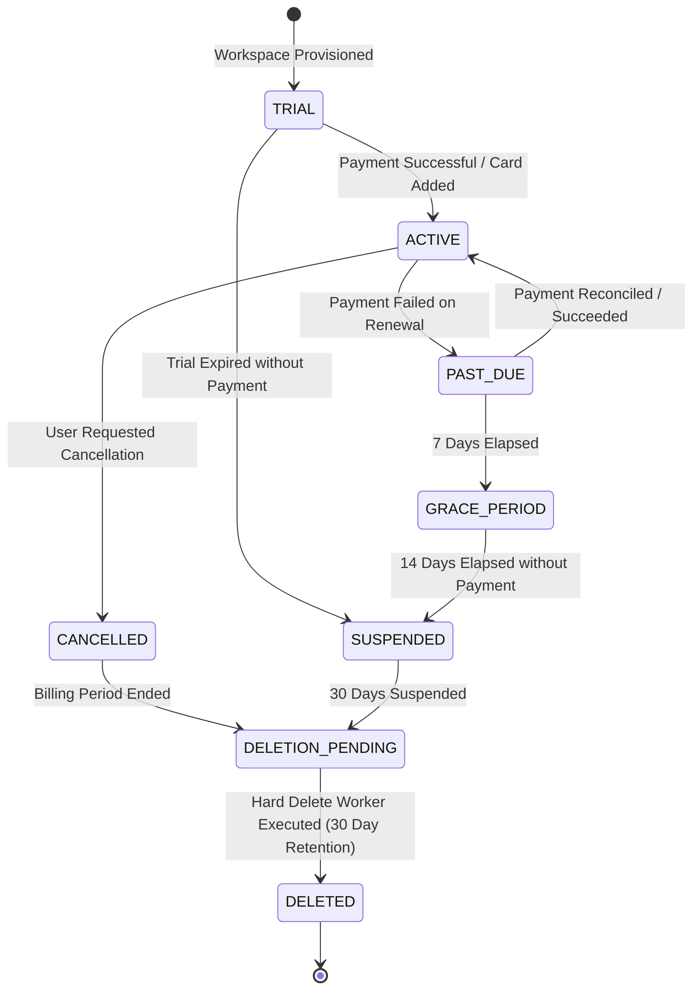

# 04 — Account & Workspace Model Architecture

**Document Version:** 1.0  
**Status:** Approved Technical Architecture  
**Scope:** Identity Hierarchy, Workspace Types, Workspace Lifecycle State Machine, and Membership Management  

---

## 1. Core Model Hierarchy

Alpha maintains a strict decoupling between **Human Identity (`User`)** and **Customer Environment (`Workspace`)**.

```text
User (Human Identity)
  │
  ├── Membership (Role, Status, Joined Date)
  │      │
  │      ▼
  └── Workspace (Tenant Environment & Resource Boundary)
         │
         ├── Subscription / Plan (Commercial Entitlements)
         ├── Organizations / Departments / Teams
         └── Cards / Leads / Analytics / Domains / NFC
```

---

## 2. Workspace Types

Alpha supports 5 distinct workspace types:

1. **Personal Workspace:** Designed for individual professionals and freelancers. Default 1 workspace created upon user registration.
2. **Team Workspace:** Designed for small teams and agencies with shared cards and member collaboration.
3. **Business / Organization Workspace:** Designed for small-to-medium businesses requiring centralized corporate identity, departments, and employee onboarding.
4. **Enterprise Workspace:** Designed for large organizations needing advanced SSO, SAML, custom security controls, and contractual billing.
5. **Agency / Reseller Workspace:** Designed for partners managing multiple customer workspaces under a single partner portal.

> **Note:** Workspace Type is separate from Commercial Subscription Plan. A `Business` Workspace Type may operate on a `Business Annual` Plan or an `Enterprise Custom` Plan.

---

## 3. Workspace Lifecycle State Machine



### State Definitions & Behavior Controls
- **`TRIAL`:** Full features active; trial banner displayed; expiration timer running.
- **`ACTIVE`:** Normal operational status; all plan entitlements enforced.
- **`PAST_DUE`:** Payment retry pending; full access maintained for 7 days; warning banner displayed.
- **`GRACE_PERIOD`:** Read-only dashboard access; public cards remain active; card creation disabled.
- **`SUSPENDED`:** Public cards display "Temporarily Unavailable"; dashboard disabled except for billing update page.
- **`CANCELLED`:** Subscription marked for non-renewal; workspace remains active until end of billing cycle.
- **`DELETION_PENDING`:** Data soft-deleted; public card URLs unlinked; 30-day recovery window open.
- **`DELETED`:** Data scrubbed or anonymized by async cleanup worker.

---

## 4. User Membership & Multi-Workspace Switching

- A single user account (`User`) can hold active memberships in an unlimited number of workspaces.
- Each membership stores `joined_at`, `status` (`ACTIVE`, `INVITED`, `SUSPENDED`), assigned `role_id`, and default workspace flag.
- **Workspace Switching:** When a user switches active workspace in the frontend dashboard, the client updates the active session or sends `X-Workspace-Id: <target_workspace_id>`. The backend validates active membership before issuing new scoped authorization tokens.
