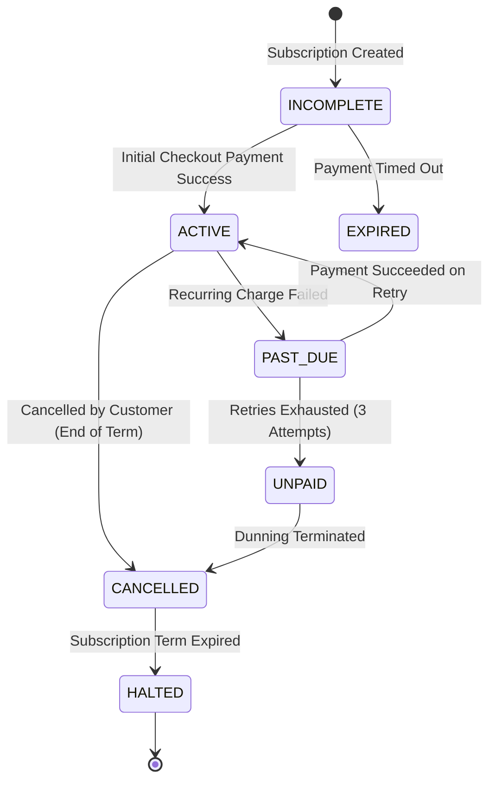

# 07 — Billing & Subscriptions Architecture

**Document Version:** 1.0  
**Status:** Approved Technical Architecture  
**Scope:** Provider-Agnostic Billing Abstraction, Razorpay Integration, Subscription State Machine, Webhook Idempotency & Reconciliation  

---

## 1. Provider-Agnostic Billing Abstraction

Alpha isolates all billing and payment vendor specifics behind a mandatory **Billing Provider Abstraction Layer (`IBillingProvider`)**. Application code and domain services interact strictly with `IBillingProvider` interfaces and standardized internal billing DTOs, preventing vendor lock-in to Razorpay.

```text
[Subscription Application Service]
                │
                ▼
      [IBillingProvider Interface]
                │
       ┌────────┴────────┐
       ▼                 ▼
[Razorpay Adapter]  [Future Stripe / Cashfree Adapter]
       │
       ▼
[Razorpay REST APIs / Webhooks]
```

---

## 2. Interface Specification (`IBillingProvider`)

```typescript
export interface IBillingProvider {
  createCustomer(workspace: WorkspaceDto): Promise<{ providerCustomerId: string }>;
  createSubscription(params: CreateSubscriptionParams): Promise<SubscriptionResultDto>;
  cancelSubscription(providerSubscriptionId: string, atPeriodEnd: boolean): Promise<boolean>;
  updateSubscriptionSeats(providerSubscriptionId: string, newSeatCount: number): Promise<SubscriptionResultDto>;
  verifyWebhookSignature(payload: string, signature: string, secret: string): boolean;
  parseWebhookEvent(rawBody: any): BillingWebhookEventDto;
}
```

---

## 3. Subscription Lifecycle State Machine



---

## 4. Razorpay Integration & Webhook Idempotency

### 4.1 Webhook Flow & Processing
1. Razorpay emits HTTP POST to `/api/v1/webhooks/billing/razorpay`.
2. **Signature Verification:** Middleware validates `X-Razorpay-Signature` against target webhook secret. Invalid signatures return HTTP 400 immediately.
3. **Idempotency Guard:** Worker checks table `billing_webhook_deliveries` using `provider_event_id`. If `status == 'PROCESSED'`, returns `200 OK` without re-processing.
4. **Async Queue Dispatch:** Validated webhook payload is enqueued into Redis `billing-events` queue for non-blocking processing.
5. **Event Handlers:**
   - `subscription.charged`: Extends subscription period, generates `Invoice` record, resets monthly usage meters.
   - `subscription.halted` / `subscription.cancelled`: Updates workspace subscription status to `CANCELLED`/`HALTED`, updates workspace state to `SUSPENDED` if grace period expires.
   - `payment.failed`: Triggers past-due dunning email notification to Workspace Owner.

```sql
CREATE TABLE billing_webhook_deliveries (
    id UUID PRIMARY KEY DEFAULT gen_random_uuid(),
    provider VARCHAR(32) NOT NULL,
    provider_event_id VARCHAR(128) NOT NULL UNIQUE,
    event_type VARCHAR(64) NOT NULL,
    payload JSONB NOT NULL,
    status VARCHAR(32) NOT NULL, -- RECEIVED, PROCESSED, FAILED
    processed_at TIMESTAMPTZ,
    error_message TEXT
);
```

---

## 5. Upgrade, Downgrade & Proration Policy

1. **Upgrades:** Applied immediately. The workspace is charged the prorated difference for the remainder of the current billing cycle. Entitlements are updated instantly upon successful payment confirmation.
2. **Downgrades:** Scheduled to take effect at the **end of the current billing cycle**. No immediate refunds are issued unless authorized by platform admin.
3. **Proration Calculation Formula:**
$$\text{Prorated Charge} = \left(\frac{\text{New Plan Rate} - \text{Old Plan Rate}}{30}\right) \times \text{Days Remaining in Cycle}$$
4. **Billing Reconciliation Worker:** Daily cron job checks database subscriptions against Razorpay subscription states to reconcile missed webhook events.
