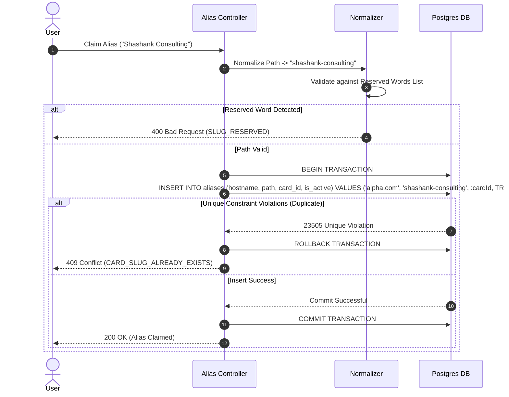

# 10 — Card Identity & URL Architecture

**Document Version:** 1.0  
**Status:** Approved Technical Architecture  
**Scope:** Three-Tier Identifier Architecture, Canonical vs Vanity URLs, Atomic Alias Allocation Algorithm & Database Uniqueness  

---

## 1. Executive Identity Principle

A digital visiting card's permanent resource identity MUST NEVER depend on mutable human attributes such as display name, person's name, email, or changeable vanity slugs. Display names change; URLs on printed physical cards and programmed NFC chips MUST remain durable for the lifecycle of the user identity.

---

## 2. Three-Tier Identifier Architecture

Every card aggregate consists of 3 distinct identification layers:

```text
┌─────────────────────────────────────────────────────────────────────────────┐
│ 1. INTERNAL DATABASE ID (UUIDv7)                                             │
│    e.g., '018f92a1-1b4c-7e89-a1b2-c3d4e5f6a7b8'                             │
│    • Primary Key in PostgreSQL                                              │
│    • Never exposed to end-users or external public URLs                     │
└─────────────────────────────────────────────────────────────────────────────┘
                                   │
                                   ▼
┌─────────────────────────────────────────────────────────────────────────────┐
│ 2. IMMUTABLE PUBLIC ID (Alphanumeric 16-char NanoID)                         │
│    e.g., '7Kx9mP4QaZ8Vt2N6'                                                 │
│    • Globally unique & immutable for the life of the card                   │
│    • Used in Canonical Public URL: https://alpha.com/c/7Kx9mP4QaZ8Vt2N6     │
│    • Used as permanent destination payload for QR codes & NFC tags          │
└─────────────────────────────────────────────────────────────────────────────┘
                                   │
                                   ▼
┌─────────────────────────────────────────────────────────────────────────────┐
│ 3. HUMAN-READABLE VANITY ALIAS (Mutable Alias Pointer)                       │
│    e.g., 'shashank' or 'shashank-consulting'                                │
│    • Human-friendly URL: https://alpha.com/shashank                         │
│    • Changeable by user; resolves to Immutable Public ID                    │
│    • Uniqueness enforced at (hostname, normalized_path) level in DB          │
└─────────────────────────────────────────────────────────────────────────────┘
```

---

## 3. URL Resolution & Namespace Hierarchy

| URL Type | URL Structure | Description & Routing |
|---|---|---|
| **Canonical URL** | `https://alpha.com/c/{public_id}` | Permanent, immutable destination URL. Highly recommended for physical QR/NFC. |
| **Vanity URL** | `https://alpha.com/{vanity_path}` | Default platform alias pointing to `public_id`. E.g., `alpha.com/john` |
| **Custom Domain URL** | `https://card.acme.com/{path}` | Enterprise white-label vanity URL routing on client domain namespace. |

---

## 4. Atomic Alias Allocation Algorithm

Vanity alias registration uses an atomic database-enforced allocation transaction to prevent race conditions or duplicate URL claims.



### Path Normalization Rules
1. Transliterate non-ASCII characters to standard Latin equivalents.
2. Convert all characters to lowercase.
3. Replace spaces, underscores, and special punctuation with single hyphens (`-`).
4. Strip leading, trailing, and duplicate hyphens.
5. Enforce length constraints: Minimum 3 characters, Maximum 50 characters.
6. Check against Reserved Words List (`admin`, `api`, `login`, `pricing`, `c`, `support`, `terms`, `privacy`, `dash`, `billing`).

---

## 5. Alias History & Redirect Policy

- **Renaming an Alias:** When a user changes an active vanity alias from `/shashank-old` to `/shashank-new`, the previous alias `/shashank-old` is retained in `aliases` table with `is_active = FALSE` and mapped as a historical redirect pointer to the card's `public_id`.
- **Redirect Response:** Requests to historical aliases return HTTP `301 Moved Permanently` pointing to the new active vanity URL or canonical URL.
- **Alias Release Retention:** Historical aliases are locked for 90 days to prevent immediate impersonation or hijacking, after which the previous owner may release or transfer the alias.
