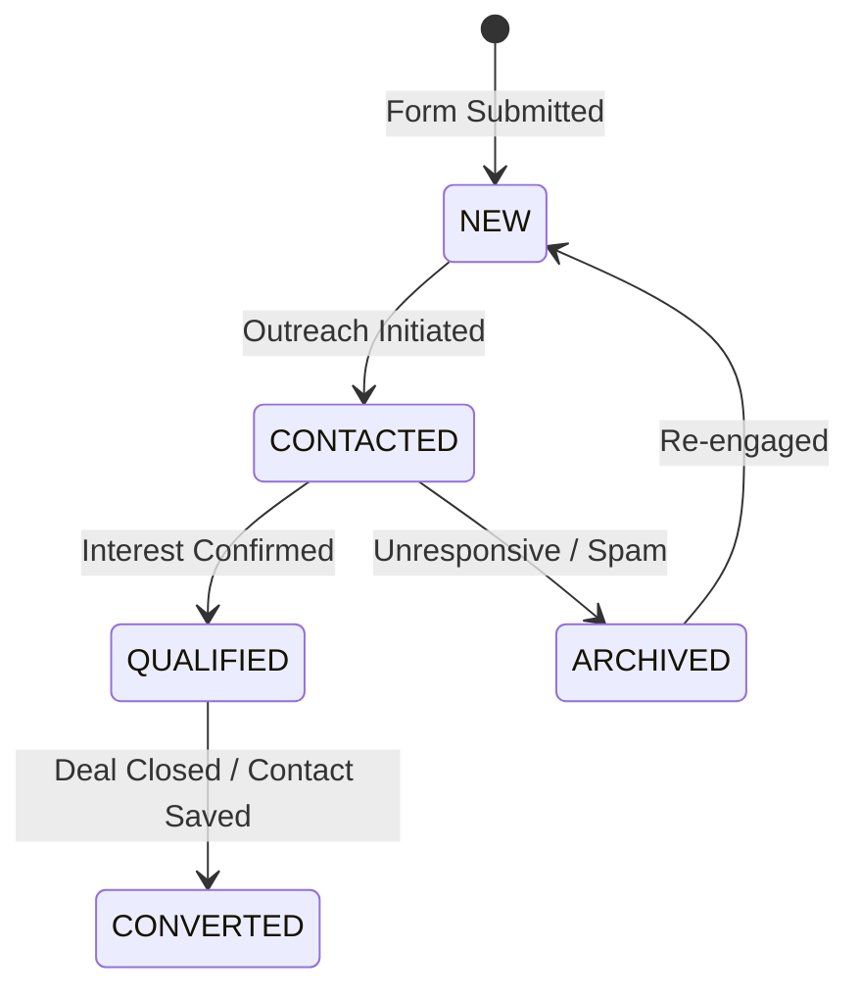

# 13 — Leads & CRM Lite Architecture

**Document Version:** 1.0  
**Status:** Approved Technical Architecture  
**Scope:** Lead Capture Subsystem, Lightweight CRM Pipeline, Contact Management, Tags & CSV/vCard Export  

---

## 1. CRM Lite Scope & Boundaries

Alpha incorporates a **Lightweight Lead Management & Contact CRM**. It is explicitly designed to turn card introductions into contacts and actionable leads without bloating into an enterprise-wide CRM system (like Salesforce or HubSpot).

```text
[Public Card Visit] ──► [Submit Lead Capture Form]
                               │
                               ▼
                    [Async Lead Capture API]
                               │
                               ├── Enqueue Lead Captured Event
                               ├── Send Real-Time Email / SMS Alert to Card Owner
                               └── Save to 'leads' Table (Status = NEW)
                                       │
                                       ▼
                         [Dashboard CRM Lite Interface]
                               ├── Pipeline Status Pipeline (NEW -> CONTACTED -> QUALIFIED -> CONVERTED)
                               ├── Notes & Activity Log
                               ├── Tagging & Assignment
                               └── Export to CSV / vCard / Webhook
```

---

## 2. Lead Capture Data Pipeline

```sql
CREATE TABLE lead_forms (
    id UUID PRIMARY KEY DEFAULT gen_random_uuid(),
    card_id UUID NOT NULL UNIQUE REFERENCES cards(id) ON DELETE CASCADE,
    form_title VARCHAR(150) DEFAULT 'Get in Touch',
    fields_config JSONB NOT NULL, -- Configures required/optional fields (name, email, phone, company, note)
    is_enabled BOOLEAN NOT NULL DEFAULT TRUE
);

CREATE TABLE lead_activities (
    id UUID PRIMARY KEY DEFAULT gen_random_uuid(),
    lead_id UUID NOT NULL REFERENCES leads(id) ON DELETE CASCADE,
    performed_by UUID REFERENCES users(id),
    activity_type VARCHAR(32) NOT NULL, -- STATUS_CHANGE, NOTE_ADDED, EMAIL_SENT, CALL_LOGGED
    description TEXT NOT NULL,
    created_at TIMESTAMPTZ NOT NULL DEFAULT CURRENT_TIMESTAMP
);
```

---

## 3. Lead Status State Machine



---

## 4. Contact Export & Integration Features

1. **CSV Export:** Bulk download of captured workspace leads formatted with standard header fields (`Name`, `Email`, `Phone`, `Company`, `Card Title`, `Captured At`, `Status`).
2. **vCard Export:** Batch generation of standard `.vcf` contact cards for direct import into mobile address books or Apple Contacts.
3. **Outgoing Webhook Hook:** Capturing a new lead emits `lead.captured` event to registered webhook endpoints (enabling native integration with Zapier, Make, or custom webhooks).
