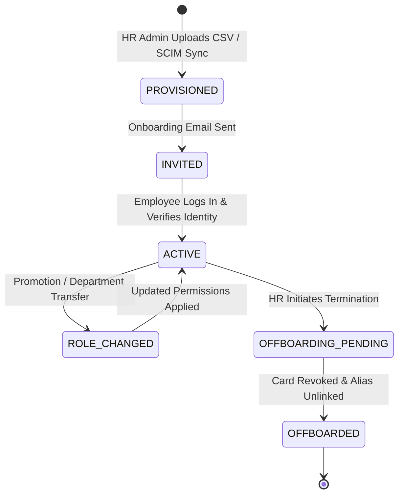

# 15 — Organization & Team Architecture

**Document Version:** 1.0  
**Status:** Approved Technical Architecture  
**Scope:** Corporate Hierarchy, Departments, Teams, Employee Onboarding & Offboarding Lifecycle  

---

## 1. Enterprise Corporate Hierarchy

For `Business`, `Organization`, and `Enterprise` workspace types, Alpha provides a structured 4-tier organization tree:

```text
Workspace (Tenant Boundary)
  │
  └── Organization (Company Profile, Global Corporate Branding)
         │
         ├── Departments (e.g., Engineering, Sales, Human Resources)
         │      │
         │      └── Teams (e.g., Enterprise Sales, Regional Sales North)
         │             │
         │             └── Workspace Members (Employees)
         │                    │
         │                    └── Managed Employee Cards
```

---

## 2. Employee Provisioning & Lifecycle



### Lifecycle Rules & Controls
1. **Bulk CSV Provisioning:** HR admins can upload a CSV file containing `first_name`, `last_name`, `email`, `department_code`, `job_title`, and `phone`. The background worker creates user accounts, assigns workspace memberships, and auto-generates draft cards pre-populated with corporate branding.
2. **Centralized Brand Lock:** Organization Admins can lock branding templates. Employees cannot alter locked fields (e.g. Company Logo, Corporate Color Palette, Footer Links), maintaining strict brand consistency.
3. **Offboarding Workflow:** When an employee leaves the company:
   - Workspace membership is set to `SUSPENDED`.
   - Employee's company card is set to `UNPUBLISHED` or `ARCHIVED`.
   - Vanity alias (e.g. `/acme-john`) is unlinked or redirected to corporate directory.
   - Captured leads remain in the corporate workspace CRM and are reassigned to team manager.
