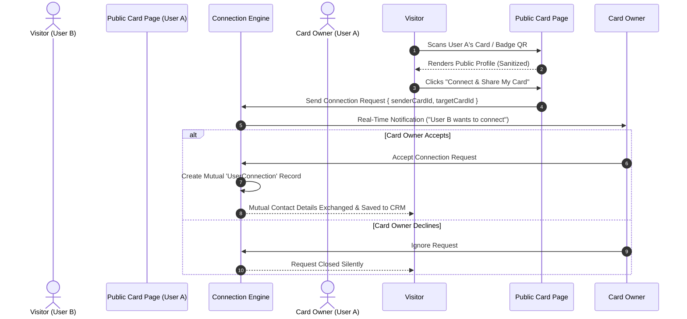

# 16 — Networking & Events Architecture

**Document Version:** 1.0  
**Status:** Approved Technical Architecture  
**Scope:** Event Cards, Conference Mode, Digital Badge QR Codes & Explicit Contact Swap  

---

## 1. Networking & Event Subsystem Overview

Alpha provides dedicated networking capabilities allowing professionals to host conference cards, issue event badges, and swap digital visiting cards with explicit privacy controls.

---

## 2. Dynamic Card Swap Protocol

Scanning a card does NOT automatically expose private personal information or add the visitor to the card owner's contacts. Connection sharing requires an explicit 2-way opt-in handshake.



---

## 3. Event & Conference Badging Schema

```sql
CREATE TABLE event_cards (
    id UUID PRIMARY KEY DEFAULT gen_random_uuid(),
    workspace_id UUID NOT NULL REFERENCES workspaces(id) ON DELETE CASCADE,
    title VARCHAR(200) NOT NULL, -- e.g., "TechSparks 2026 Summit"
    location VARCHAR(200),
    start_date TIMESTAMPTZ NOT NULL,
    end_date TIMESTAMPTZ NOT NULL,
    badge_template_config JSONB DEFAULT '{}',
    created_at TIMESTAMPTZ NOT NULL DEFAULT CURRENT_TIMESTAMP
);

CREATE TABLE user_connections (
    id UUID PRIMARY KEY DEFAULT gen_random_uuid(),
    requester_user_id UUID NOT NULL REFERENCES users(id),
    recipient_user_id UUID NOT NULL REFERENCES users(id),
    status VARCHAR(32) NOT NULL DEFAULT 'PENDING', -- PENDING, ACCEPTED, REJECTED
    connected_at TIMESTAMPTZ,
    UNIQUE(requester_user_id, recipient_user_id)
);
```
