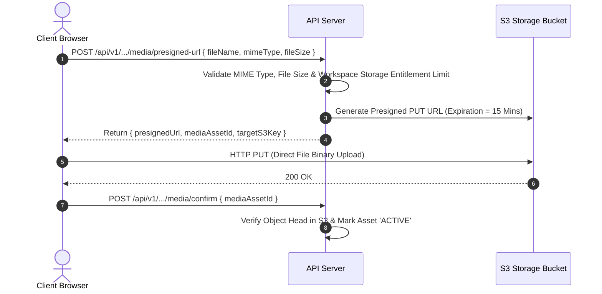

# 21 — Media Storage Architecture

**Document Version:** 1.0  
**Status:** Approved Technical Architecture  
**Scope:** S3 Object Storage Topology, Presigned Upload URLs, Image Optimization & Media Security  

---

## 1. Storage Topology & Partitioning

All binary assets (profile avatars, corporate logos, card cover banners, gallery images, custom CSS, vCards) are stored in S3-compatible object storage (AWS S3 / Cloudflare R2).

### S3 Key Naming Convention
```text
workspaces/{workspace_id}/cards/{card_id}/avatars/{file_uuid}.webp
workspaces/{workspace_id}/logos/{file_uuid}.png
public/templates/{template_id}/preview.jpg
```

---

## 2. Secure Direct-to-S3 Presigned Upload Flow

To minimize API server memory overhead, file uploads DO NOT buffer through NestJS API servers. Clients request a secure presigned upload URL and upload directly to S3.



---

## 3. Upload Validation & Optimization Matrix

| Asset Type | Allowed MIME Types | Max Size | Target Dimensions / Processing |
|---|---|---|---|
| **Avatar / Profile Photo** | `image/jpeg`, `image/png`, `image/webp` | 5 MB | Auto-crop 1:1, resize to 800x800 `.webp` |
| **Company Logo** | `image/jpeg`, `image/png`, `image/svg+xml`, `image/webp` | 5 MB | Max width 1200px, preserve transparency |
| **Cover Banner** | `image/jpeg`, `image/png`, `image/webp` | 10 MB | Auto-resize to 1920x1080 `.webp` |
| **Gallery Images** | `image/jpeg`, `image/png`, `image/webp` | 10 MB | Optimize to WebP format, quality 85% |

---

## 4. Security Controls
1. **MIME Type Validation:** Client-supplied MIME types are checked against an explicit whitelist. Executable files (`.exe`, `.php`, `.js`, `.html`) are strictly rejected.
2. **CDN Cache Headers:** Public images are delivered via Cloudflare CDN with `Cache-Control: public, max-age=31536000, immutable`.
